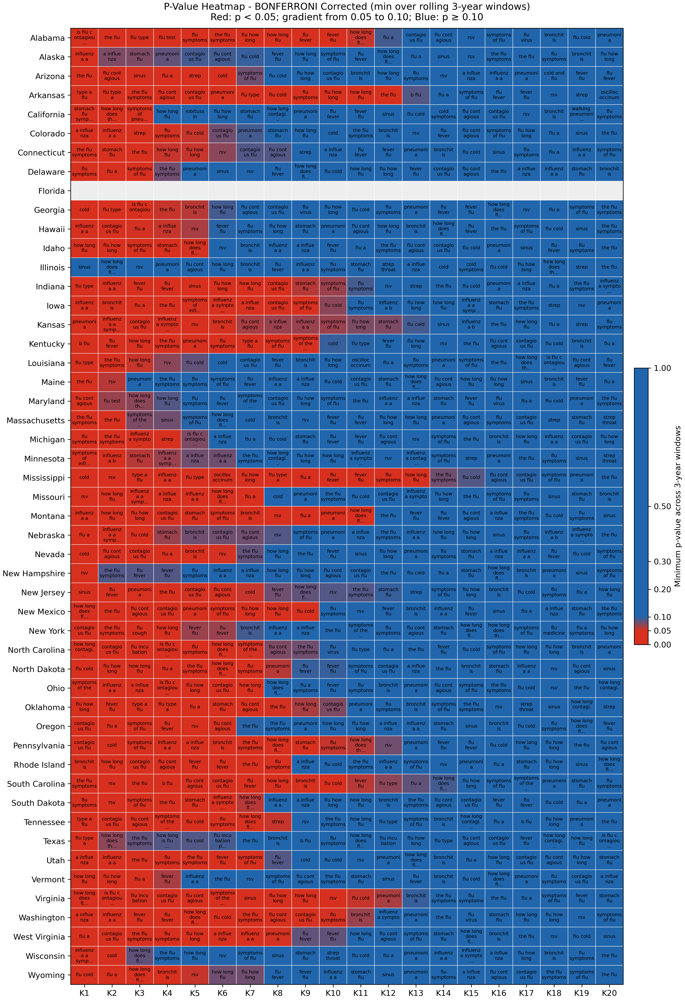
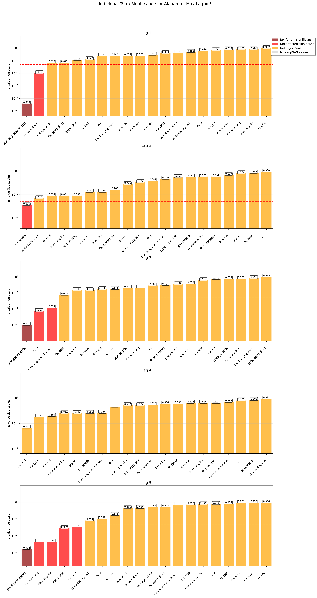
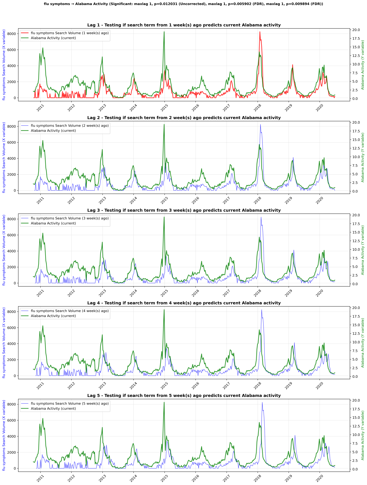
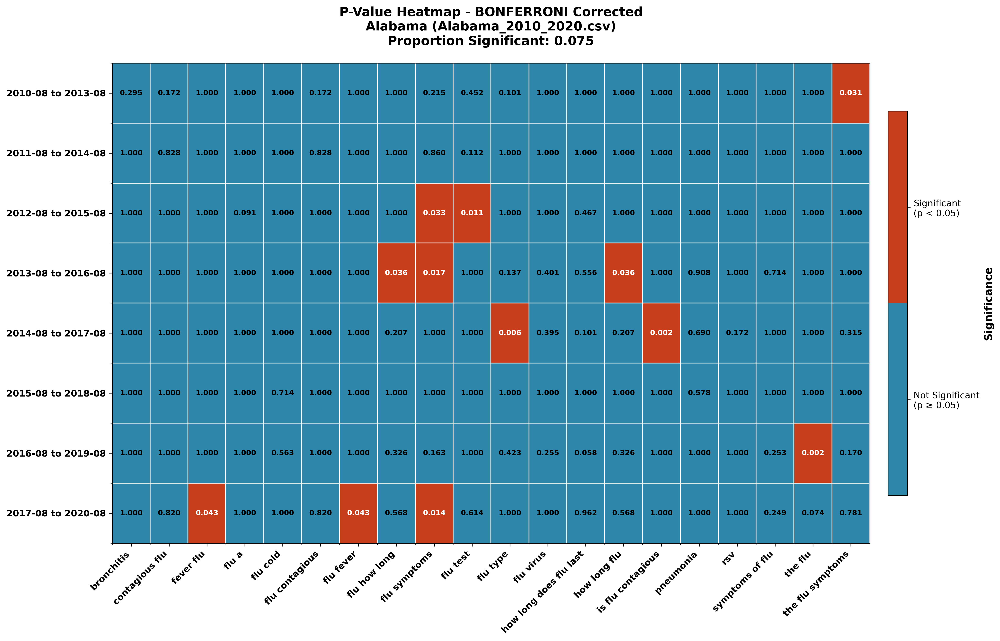
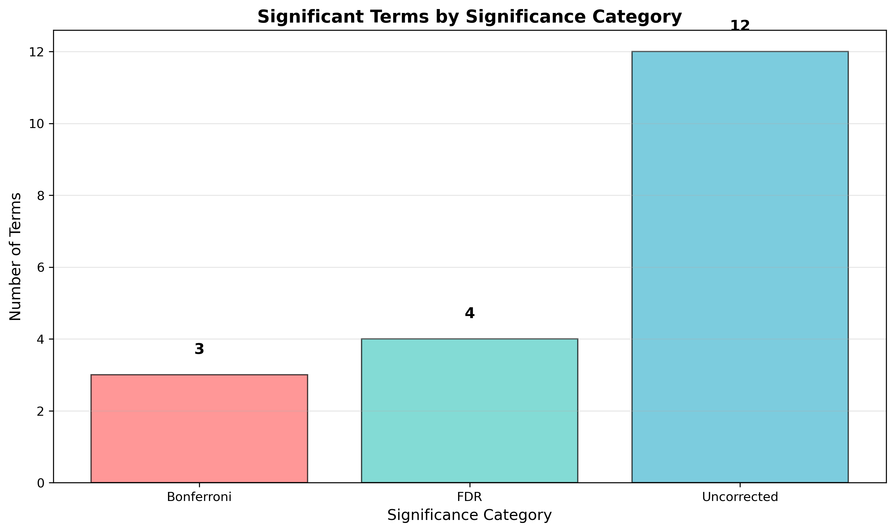

# Granger Causality Analysis: Google Search Trends and ILI Rates

An evaluation of Granger-causal relationships between aggregate Google search query volumes and CDC Influenza-Like Illness (ILI) rates across 50 U.S. states (2010–2020).


*Bonferroni-corrected p-value heatmap showing temporal stability of Granger-causal relationships across 63 search terms and 50 states.*

---

## Overview

This project investigates whether Google search query volumes exhibit Granger-causal relationships with CDC ILI rates. Unlike correlation analysis, Granger causality tests whether lagged values of one time series improve predictions of another beyond what the target series' own history provides.

The analysis addresses a key limitation of prior work: predictive relationships may be **temporally unstable**. To evaluate this, the pipeline implements rolling-window validation across overlapping 3-year periods.

### Capabilities

| Feature | Description |
|---------|-------------|
| **Rolling-Window Validation** | 3-year sliding windows with 1-year steps to assess temporal stability |
| **Multi-Region Analysis** | Batch processing across all 50 U.S. states and national aggregate |
| **Multiple Testing Correction** | Bonferroni and Benjamini-Hochberg (FDR) adjustments |
| **Reproducible Workflow** | Centralized configuration, modular codebase, documented outputs |

---

## Quick Start

### 1. Install Dependencies
```bash
pip install -r requirements.txt
```

### 2. Configure Analysis
All parameters are centralized in `src/confs.py`:

```python
# src/confs.py
response_var = "Alabama"        # Target variable for causality testing
max_lags_to_test = 5            # Maximum weekly lag to analyze (1-5 weeks)
rolling_window_years = 3        # Window size for temporal stability analysis
alpha_level = 0.05              # Significance threshold
bonferroni_alpha = 0.05         # Threshold for Bonferroni correction
```

### 3. Run the Pipeline

```bash
cd src/

# Full batch analysis (all 50 states)
python analyze_multiple_data_files.py

# Rolling window analysis
python run_rolling_window_analysis.py

# Generate cross-state heatmaps
python plot.py
```

---

## Output Categories

The pipeline produces four primary output categories for each state analyzed:

### 1. Significance Testing (Bar Charts)
P-value distributions for each search term at lags 1–5 weeks, with color-coded significance thresholds.



### 2. Temporal Trends (Time Series)
Lagged search volume plotted against ILI rates for terms showing significant relationships.



### 3. Stability Analysis (Heatmaps)
Rolling-window p-values showing whether Granger-causal relationships persist or decay across time periods.



### 4. Comparative Statistics
Aggregated significance counts across correction methods (Raw, FDR, Bonferroni).



---

## Batch Processing

The pipeline processes multiple datasets without manual intervention:

```python
# src/run_rolling_window_analysis.py
class MultiStateRollingAnalysis:
    def run_analysis_for_all_datasets(self):
        for data_file in self.states_to_analyze:
            state_name = data_file.replace('_2010_2020.csv', '')
            analyzer = RollingWindowAnalyzer(data_file, state_name)
            analyzer.run_rolling_analysis()
            
            if analyzer.results:
                self.results[state_name] = analyzer.results
        
        self.generate_comparative_analysis()
```

---

## Methodology

### Granger Causality Test

The test compares two nested OLS regression models:

```python
# src/granger_causality_pipeline_refactored.py
def perform_granger_causality_test(self, df_processed: pd.DataFrame, response_lags: List[str], 
                                   all_lags: List[str], response_column: str) -> Optional[GrangerResults]:
    """Perform the main Granger causality test."""
    regression_data = df_processed.dropna()
    
    # Restricted model: Y predicted by its own lagged values only
    X_restricted = sm.add_constant(regression_data[response_lags])
    y = regression_data[response_column]
    model_restricted = sm.OLS(y, X_restricted).fit()
    
    # Unrestricted model: Y predicted by its own lags + search term lags
    X_unrestricted = sm.add_constant(regression_data[response_lags + all_lags])
    model_unrestricted = sm.OLS(y, X_unrestricted).fit()
    
    # F-test for nested model comparison
    rss_restricted = np.sum(model_restricted.resid ** 2)
    rss_unrestricted = np.sum(model_unrestricted.resid ** 2)
    df1 = len(all_lags)
    df2 = len(regression_data) - X_unrestricted.shape[1]
    
    F = ((rss_restricted - rss_unrestricted) / df1) / (rss_unrestricted / df2)
    p_value = 1 - f.cdf(F, df1, df2)
```

If `p_value < α`, the search term exhibits Granger-causal precedence for the ILI rate.

### Multiple Testing Correction

With 63 terms × 5 lags × 50 states, multiple testing correction is essential:

| Method | Description |
|--------|-------------|
| **Bonferroni** | Divides α by number of tests. Controls family-wise error rate. |
| **FDR (Benjamini-Hochberg)** | Controls false discovery rate. Less conservative than Bonferroni. |
| **Raw** | Uncorrected p-values. Baseline for comparison. |

### Rolling-Window Validation

A 3-year window slides across the 10-year dataset with 1-year steps, producing 8 overlapping analysis periods. This reveals whether Granger-causal relationships are stable or transient.

---

## Dynamic Text Fitting

The cross-state heatmap implements dynamic text sizing to ensure readability across varying grid dimensions:

```python
# src/plot.py
def _calculate_dynamic_text_params(fig, ax, n_rows: int, n_cols: int, 
                                   min_font_size: int = MIN_FONT_SIZE, 
                                   max_font_size: int = MAX_FONT_SIZE) -> Tuple[int, int]:
    """Calculate dynamic font size and wrap width based on cell dimensions."""
    fig_width, fig_height = fig.get_size_inches()
    
    cell_width = fig_width / n_cols
    cell_height = fig_height / n_rows
    
    # Scale font to 70% of cell height, convert to points
    target_text_height = cell_height * TEXT_FIT_RATIO
    calculated_font_size = int(target_text_height * DPI / 72 * 1.2)
    font_size = max(min_font_size, min(max_font_size, calculated_font_size))
    
    # Calculate wrap width based on cell width
    chars_per_inch = 6 if font_size <= 6 else 8
    target_chars_per_line = int(cell_width * chars_per_inch * TEXT_WIDTH_RATIO)
    wrap_width = max(8, min(20, target_chars_per_line))
    
    return font_size, wrap_width
```

---

## Results Summary

Analysis of 63 search terms across 50 states (2010–2020):

| Correction | Terms Significant in ≥1 State | Proportion |
|------------|-------------------------------|------------|
| Raw | 62/63 | 98.4% |
| FDR | 52/63 | 82.5% |
| Bonferroni | 44/63 | 69.8% |

**Key observation**: Granger-causal relationships exhibit temporal instability. Terms significant in early windows (2010–2013) frequently lose significance in later periods (2017–2020), suggesting that predictive models require periodic recalibration.

---

## Limitations & Future Directions

While this framework provides robust tools for evaluating predictive utility, the current implementation uses Ordinary Least Squares (OLS) on raw time-series data. The primary focus of this iteration was **temporal stability analysis**—determining whether predictive relationships persist across time—rather than strict stationarity enforcement.

* **Stationarity**: ILI rates and search volumes exhibit strong seasonality. A natural extension would implement **Augmented Dickey-Fuller (ADF)** tests and **differencing** (analyzing ΔSearch vs. ΔFlu) to control for non-stationarity. The rolling-window approach partially addresses this by isolating shorter time periods where trends are more locally stationary.

* **Linearity**: The Granger test assumes linear relationships. Future work could explore nonlinear causality using transfer entropy or kernel-based methods.

---

## Project Structure

```
Granger-Causality/
├── data/                    ← 51 CSV files (50 states + US national)
├── results/
│   ├── heatmaps/            ← Cross-state aggregate visualizations
│   └── granger_causality_results/
│       ├── Alabama/
│       ├── Alaska/
│       └── ...
├── src/
│   ├── confs.py             ← Central configuration
│   ├── granger_causality_pipeline_refactored.py
│   ├── rolling_window_analysis.py
│   ├── plot.py
│   └── ...
├── requirements.txt
└── README.md
```

---

## Data Format

Input CSVs require the following structure:

```csv
date,Alabama,flu symptoms,the flu,rsv,...
2010-10-09,1.13505,53.34,0.0,0.0,...
2010-10-16,1.25256,50.37,0.0,0.0,...
```

- **Column 1**: `date` (YYYY-MM-DD format)
- **Column 2**: Response variable (state/region name) containing ILI rates
- **Columns 3+**: Search term volumes (Google Trends index values)

---

## Dependencies

```
numpy>=1.21.0
pandas>=1.3.0
statsmodels>=0.13.0
scipy>=1.7.0
matplotlib>=3.5.0
seaborn>=0.11.0
```

---

## Author

**Xi Chen** — September 2025
